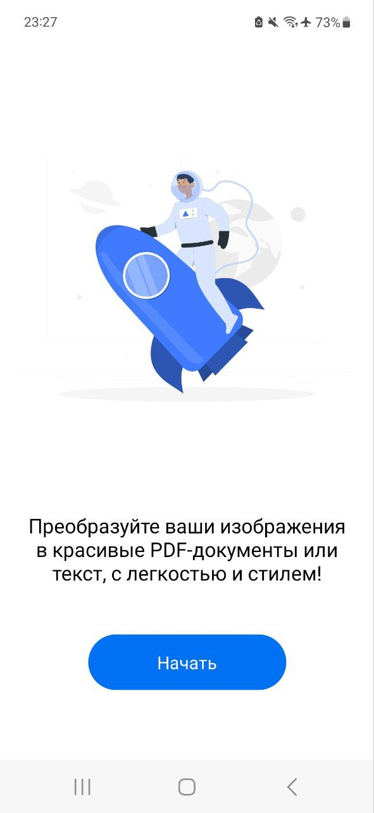
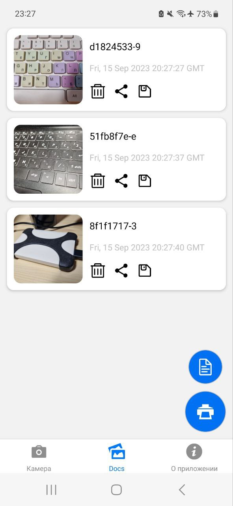
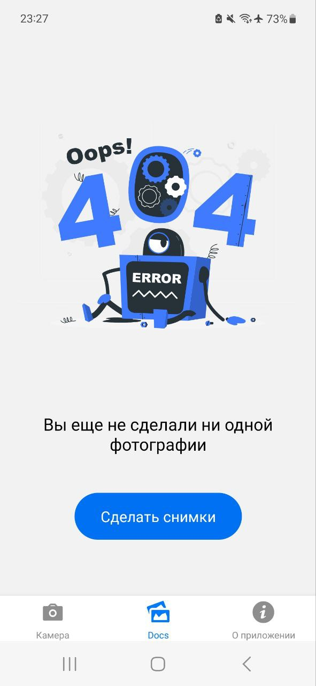
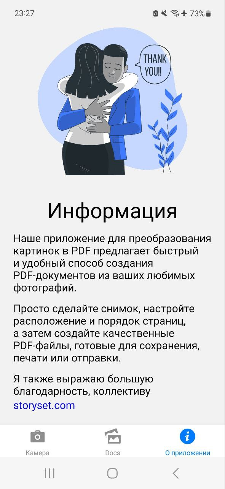

Название: "Pdf Envelope"
Описание:
"Pdf Envelope" - удобное и легкое в использовании мобильное приложение, разработанное для конвертации фотографий в формат PDF. С его помощью вы можете легко сохранить ваши фотографии, сканы документов, или любые другие изображения в удобном и многофункциональном формате PDF.

Особенности:
1. Простой интерфейс: Интуитивно понятный и легкий в использовании интерфейс делает процесс конвертации максимально простым и доступным для пользователей всех уровней.
2. Многоформатность: Поддерживается широкий спектр форматов фотографий, включая JPEG, PNG, BMP и другие. Вы можете конвертировать как одиночные фотографии, так и несколько изображений одновременно.
3. Настраиваемые опции: Вы можете выбрать параметры конвертации, такие как размер и качество файла PDF, поля, ориентацию страницы и другие. Это позволяет вам настроить результат под свои потребности.
4. Редактирование и организация: После конвертации фотографий в PDF, вы можете легко редактировать порядок страниц, поворачивать изображения, обрезать ненужные области, добавлять подписи, аннотации или водяные знаки.
5. Облачное хранилище и обмен: Поддержка популярных облачных сервисов, таких как Google Drive, Dropbox, OneDrive, позволяет вам сохранять и синхронизировать ваши PDF файлы на разных устройствах и делиться ими с другими пользователями.

Не упустите возможность быстро и удобно конвертировать фотографии в PDF с помощью мобильного приложения "Pdf Envelope". Оцифруйте свои документы или создайте электронные альбомы с легкостью!

